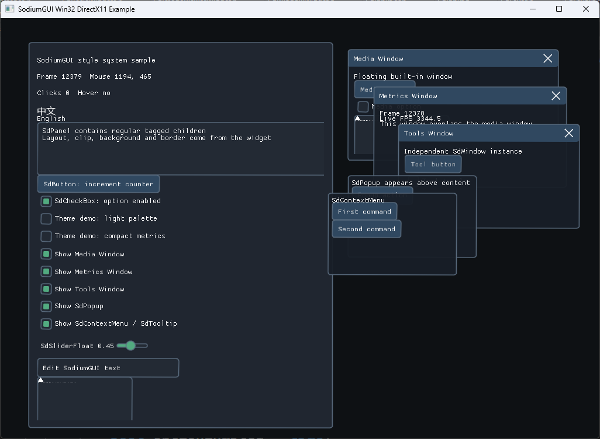

# SodiumGUI

SodiumGUI 是一个 C++20 轻量级 GUI 框架。应用每帧通过 `SdUi` 声明界面，运行时内部保留稳定的 widget record、typed state、keyed model、style node、布局缓存、输入交互状态、动画通道、layer/hit-test 数据、字体资源和渲染资源。

当前项目重点是 Windows 桌面、DirectX 11、DirectX 12 和 overlay 场景。仓库包含 Win32 platform backend、DX11/DX12 renderer 和 RHI backend、FreeType/STB 字体 backend、内置 widget、RHI/effect 框架、示例工程和核心测试。



## 特性

- C++20 API，公共类型位于 `Sodium` 命名空间。
- `SdUi::Declare<T>()`、`DeclareKeyed<T>()`、`DeclareStyled<T>()`、`DeclareStyledKeyed<T>()` 类型化声明 API。
- 持久化 `SdWidgetRecord`，支持 widget lifecycle、typed state、keyed model、style node 和动画通道。
- 可选 widget phase callback：`OnCreate`、`OnUpdate`、`OnLayout`、`OnArrange`、`OnPaint`。
- 内置 widget：文本、面板、按钮、复选框、滑条、文本输入、窗口、图片查看器、滚动区域、弹出层、上下文菜单和 tooltip。
- 强类型 Style 系统，支持 compiled stylesheet、cascade layer、pseudo state、class/scope、design token、part style 和 presentation animation。
- `SdBoxTree` 布局系统，支持 block、inline-block、flex、absolute/manual layout、margin、padding、border、gap 和 box sizing。
- Layer/portal/interaction 系统，支持 root layer、stacking context、portal、draw channel、hit-test、hover、pressed、click、focus、capture 和 drag/drop 状态。
- `SdRenderList -> SdRenderPacket` 渲染模型，每帧重建 CPU draw data，renderer backend 复用 GPU buffer、texture 和 resource set。
- RHI 与 Effect 框架，当前内置 blur、backdrop blur、drop shadow、inner shadow、mask 和 custom effect 支持。
- UTF-8 文本模型，字体资源和 atlas upload 由 FreeType 或 STB font backend 提供。

## 目录结构

```text
.
├── SodiumGUI.h                         # 主聚合头文件
├── Core/                               # 实例、运行时、storage、backend contract、UTF-8、text
├── Widget/                             # SdUi、context、基础 widget
├── Input/                              # input event 和 snapshot
├── Style/                              # style core、stylesheet、resolver、animation、默认样式
├── Layout/                             # SdBoxTree
├── Layer/                              # layer、stacking、portal、interaction
├── Animation/                          # animation channel
├── Render/                             # RenderList、RenderData、RenderStats
├── Rhi/                                # GPU device、command encoder、render graph
├── Effects/                            # built-in 和 custom effect
├── backends/
│   ├── Win32/
│   ├── Dx11/
│   ├── Dx12/
│   ├── FreeType/
│   └── Stb/
├── examples/
│   ├── desktop/win32_directx11
│   ├── desktop/win32_directx12
│   ├── dynamic/dll_dx11_win32
│   └── dynamic/dll_dx12_win32
├── tests/CoreTests.cpp
├── scripts/Verify.ps1
└── docs/
```

## 环境要求

- Windows 10 或更新版本。
- Visual Studio 2022 或 Build Tools，包含 MSVC v143、MSBuild 和 Windows SDK。
- C++20 编译支持。
- DirectX 11 / DirectX 12 头文件和库，通常由 Windows SDK 提供。
- FreeType 开发库，如果使用 `backends/FreeType`。
- `third_party/stb/stb_truetype.h` 已随仓库提供，用于 STB font backend。

## 构建与验证

打开示例解决方案：

```powershell
start .\examples\examples.sln
```

或使用验证脚本构建核心测试和示例：

```powershell
.\scripts\Verify.ps1 -Configuration Debug -Platform x64
```

只构建并运行核心测试：

```powershell
.\scripts\Verify.ps1 -Configuration Debug -Platform x64 -SkipExamples
```

示例解决方案包含：

- `win32_directx11`：Win32 + DirectX 11 桌面窗口示例。
- `win32_directx12`：Win32 + DirectX 12 桌面窗口示例，使用原生 D3D12 command list 提交 GUI。
- `dll_dx11_win32`：基于现有 DXGI swap chain 的动态库 overlay 示例。
- `dll_dx12_win32`：基于现有 DXGI swap chain 和 D3D12 command queue 的动态库 overlay 示例。

## 快速使用

包含主头文件和所需 backend：

```cpp
#include <SodiumGUI.h>
#include <Backends/Win32/SdWin32Platform.h>
#include <Backends/Dx11/SdDx11Renderer.h>
#include <Backends/FreeType/FreeTypeFontBackend.h>
```

初始化：

```cpp
Sodium::SdInstance gui = {};
Sodium::Backends::SdWin32Platform platform = {};
Sodium::Backends::SdDx11Renderer renderer = {};
Sodium::Backends::SdFreeTypeFontBackend fontBackend = {};

platform.Initialize(Sodium::Backends::SdWin32PlatformConfig(windowHandle));
renderer.Initialize(Sodium::Backends::SdDx11RendererConfig(device, deviceContext));
fontBackend.Initialize();
gui.Initialize(platform, renderer, fontBackend);
```

每帧声明、结束并渲染：

```cpp
gui.BeginFrame();

gui.ui.Declare<Sodium::SdText>("Hello SodiumGUI");
gui.ui.DeclareKeyed<Sodium::SdButton>("apply_button", "Apply");
gui.ui.Declare<Sodium::SdCheckBox>("Enable option", enabled);

gui.EndFrame();
gui.Render();
```

关闭：

```cpp
gui.Shutdown();
fontBackend.Shutdown();
renderer.Shutdown();
platform.Shutdown();
```

## 架构文档

当前架构文档已按实际代码实现重写：

- `docs/SdGUI_Architecture.md`：英文架构文档。
- `docs/SdGUI_Architecture.zh-CN.md`：中文架构文档。

文档中包含当前 frame flow、runtime storage、style/layout/layer/render/RHI/effect/backend 说明，以及“与旧架构文档的主要差异”。

## 设计模型

SodiumGUI 的实际模型是：

```text
应用拥有 SdInstance 和 backends。
每帧通过 SdUi 声明 widget。
声明解析为稳定 SdWidgetId / SdResolvedKey。
SdStateStorage 保留 widget record、typed object、state、style node 和 model。
EndFrame 统一执行 lifecycle、style、layout、arrange、animation、layer 排序、hit-test 数据生成和可见 widget paint。
RenderList 构建 SdRenderPacket。
Renderer backend 在宿主 render loop 内提交 packet，但不接管 clear/present。
```

这种模型保留 immediate-style 声明的低样板，同时支持跨帧状态、样式、动画、layer、字体和 GPU 资源复用。

## 许可证

Copyright 2026 SodiumGUI contributors.

本项目采用 Apache License 2.0 协议发布。详见 `LICENSE`。

## 致谢

感谢 GPT 和 mashiro 中转站在项目开发过程中提供的辅助，包括架构梳理、文档编写、代码组织建议和日常开发问题分析。
