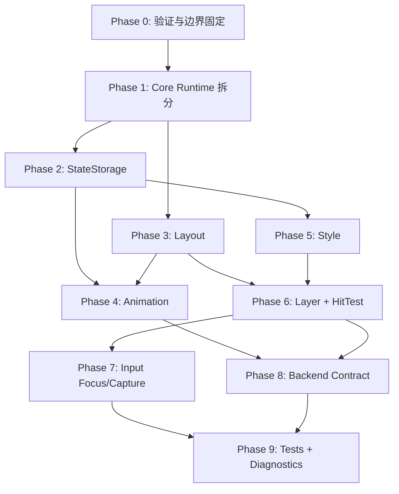

# SdGUI 下一步开发计划：基础设施优先

版本：v0.1
对应架构：`SdGUI_Architecture.zh-CN.md` v0.4
当前基线：MVP 已可运行，完整架构约 60% 完成
目标：先补齐框架级基础设施，再扩展控件和后端

## 1. 总目标

下一阶段不以新增控件数量为主目标，而是优先完成 SdGUI 的基础设施，使后续控件、后端、示例和性能优化都能建立在稳定结构上。

本阶段完成后，项目应具备以下能力：

```text
1. Core runtime 不再把所有系统逻辑集中在 SdInstance / SdRuntime.inl 中。
2. Widget 状态、用户 typed state、layout cache、style cache 和 animation channel 有明确所有权。
3. Layout 使用 frame-local 连续数组表达 parent/child 关系。
4. Animation 有独立 active channel 更新路径。
5. Style 有 token/theme/computed style 的基础解析路径。
6. Layer 统一负责 paint order、hit-test order 和 clip/scissor 路由。
7. Input 支持 focus、capture、hover、active 的统一交互结果。
8. Platform / Renderer / Font 等外部接口指针全部直接放入 SdContext。
9. Renderer backend 对外使用单次 Render 提交，DX11 只是第一个实现。
10. 至少具备可重复运行的构建验证和核心逻辑测试。
```

## 2. 开发原则

```text
基础设施优先于控件扩展。
清晰所有权优先于快速堆叠功能。
先稳定内部数据流，再优化公开 API 细节。
默认匿名声明，只有需要稳定外部寻址的组件使用 keyed 声明。
key 是框架层身份，label/title/text 是控件层参数，二者不得混用。
keyed model 是组件可选能力，不强制所有组件持有 model。
外部配置应面向 keyed model，不直接操作当前 widget object。
先保证单一 Win32 + DX11 路径正确，再扩展其他 backend。
每个阶段必须有可验证的完成标准。
```

本阶段暂不优先处理：

```text
1. 大量新增业务控件。
2. Dx9 / Dx12 / OpenGL backend。
3. 复杂文本 shaping、RTL、多字体 fallback chain。
4. 完整主题编辑器或可视化样式编辑工具。
5. 大规模目录迁移和无行为收益的重命名。
```

## 3. 当前实现基线

当前 MVP 已经具备：

```text
1. SdInstance 作为用户拥有的 runtime instance。
2. SdUi::Declare<T>() typed declaration API。
3. SdWidgetTag 编译期约束。
4. 基于 SdWidgetId 的持久 widget record。
5. Entering / Alive / Leaving / Dead 生命周期。
6. context.State<T>() typed user state。
7. Create / Update / Layout / Paint phase context。
8. frame-local SdRenderData / SdRenderList。
9. DX11 persistent vertex/index buffer。
10. UTF-8 decoding。
11. FreeType glyph atlas 和文本渲染。
12. Win32 input integration。
13. Text / Panel / Button / CheckBox / Window / ImageViewer。
14. desktop Win32 + DX11 示例和 dynamic DLL DX11 示例。
```

当前主要缺口：

```text
1. Core runtime 过于集中，缺少 SdContext / FrameState / Manager 拆分。
2. StateStorage 仍直接嵌在 SdInstance 的 widget map 中。
3. Layout 仍是简单纵向安排和 window 手动布局，不是完整 layout tree。
4. Animation 只有 layoutWeight / opacity 的线性推进。
5. Style 只有 token 和 computed style 数据结构，没有 rule 解析。
6. Layer 只有 priority 字段和 paint sort，没有 LayerManager。
7. Input 没有统一 focus/capture/hit-test 流程。
8. Backend contract 没有完全接口化，DX11 类型仍承担事实标准。
9. 缺少自动化测试和基础性能/分配观测。
10. 示例层仍直接调用 renderer.BeginFrame / Submit / EndFrame，提交模型需要收敛为 Render。
```

## 4. 推荐开发顺序

```text
Phase 0: 验证与边界固定
Phase 1: Core Runtime 拆分
Phase 2: StateStorage 基础设施
Phase 3: Layout 基础设施
Phase 4: Animation 基础设施
Phase 5: Style 基础设施
Phase 6: Layer + HitTest 基础设施
Phase 7: Input Focus/Capture 基础设施
Phase 8: Backend Contract 固化
Phase 9: 测试、诊断和完成度门禁
```

依赖关系：



## 5. Phase 0：验证与边界固定

目标：在重构基础设施前，建立可重复验证的最小门禁。

任务：

```text
1. 固定当前 desktop win32_directx11 示例的 Debug x64 构建命令。
2. 固定 dynamic dll_dx11_win32 示例的 Debug x64 构建命令。
3. 新增最小 core smoke test 工程或命令：
   - 创建 SdInstance。
   - BeginFrame。
   - Declare 一个测试 widget。
   - EndFrame。
   - 检查 draw packet / lifecycle 状态。
4. 记录当前已知 out-of-scope，避免重构期间误判为回归。
5. 增加简单 CI/本地脚本入口，至少能一键构建两个示例。
```

完成标准：

```text
1. 两个示例工程可从命令行稳定构建。
2. core smoke test 可在无窗口环境运行。
3. 后续阶段每次改动都能用同一套命令验证。
```

## 6. Phase 1：Core Runtime 拆分

目标：把 `SdInstance` 从“所有系统的容器和调度器”拆成更明确的 runtime 组合对象。

建议新增或重构的内部结构：

```text
SdContext
- SdFrameState
- ISdPlatformBackend*
- ISdRendererBackend*
- ISdFontBackend*
- optional allocator / clock / logger
- future clipboard / cursor / ime service
- SdIdStack
- SdStateStorage
- SdInputSystem
- SdLayoutSystem
- SdStyleSystem
- SdAnimationSystem
- SdLayerSystem
- SdRenderSystem

SdFrameState
- frameIndex
- deltaTime
- displaySize
- submitted widget count
- live widget count

SdIdStack
- parent stack
- ordinal per parent
- key scope stack
- anonymous id path
- keyed id path
- resolved key registry
- future callsite identity hook
```

任务：

```text
1. 保留公开 SdInstance API，不破坏示例调用方式。
2. 将 frameIndex / deltaTime / displaySize 收敛到 SdFrameState。
3. SdContext 直接持有 backend/service interface 指针。
4. SdInstance 初始化时写入 context 中的 platform / renderer / fontBackend 指针，SdUi / phase context 只从 SdContext 获取接口。
5. 将 ResolveWidgetId / parentStack 从 SdUi 拆到 SdIdStack 或内部 helper。
6. 保留 `SdUi::Declare<T>()` 匿名声明语义：按 parent scope、type identity、ordinal 解析内部 SdWidgetId。
7. 新增 `SdUi::DeclareKeyed<T>(key, args...)` 或等价 API：key 由框架消费，不传给 widget callback。
8. 在 IdStack 中区分 anonymous id path 和 keyed id path，并建立 resolved key 到 SdWidgetId 的登记路径。
9. 给 BeginFrame / EndFrame 建立明确阶段：
   - BeginInput
   - BeginUi
   - Declaration
   - EndDeclaration
   - Layout
   - Animation
   - Paint
   - BuildRenderPacket
   - Sweep
10. 用真实时间更新 deltaTime，保留可测试的 override 入口。
11. 增加 SdInstance::Render 或 SdRenderSystem::Render，由 context 中的 renderer backend 指针消费 draw packet。
```

完成标准：

```text
1. SdInstance 仍是用户唯一需要拥有的对象。
2. SdRuntime.inl 不再承担所有核心系统逻辑。
3. frame flow 的每个阶段都有独立函数或系统对象。
4. Platform / Renderer / Font 依赖不再通过全局对象或示例层临时传递。
5. `Declare<T>()` 仍可用于不需要外部访问的匿名组件。
6. `DeclareKeyed<T>()` 可以生成稳定可查找的 resolved key，且 key 不传入 widget `OnUpdate`。
7. desktop 示例行为不回退。
```

## 7. Phase 2：StateStorage 基础设施

目标：让 widget record、user state、layout cache、style cache、animation channel 有明确存储边界。

建议模型：

```text
SdStateStorage
- widget records
- typed user states
- optional keyed component models
- layout cache
- style cache
- animation channels
- interaction state
```

短期实现可以继续使用 `std::unordered_map`，但要把所有权从 `SdInstance` 中分离出来。

任务：

```text
1. 新增 SdStateStorage 类型。
2. 将 SdWidgetRecord 从 SdInstance 私有结构迁出到内部 runtime storage。
3. 保留 GetOrCreateWidgetRecord / GetOrCreateUserState 语义。
4. 新增 keyed model storage 能力，但不要求所有组件创建 model。
5. 提供 `context.Model<T>()` 或等价内部 API：只允许 keyed widget 使用，匿名 widget 在 debug build 中应 assert 或进入明确错误路径。
6. 提供 `ui.Model<TWidget>(key)` / `ui.ConfigureModel<TWidget>(key, fn)` 或等价外部配置入口，配置目标是 model，不是当前 widget object。
7. 将 Dead widget 的 record 和 typed user state 一起清理，但不因 widget 离场自动删除 keyed model。
8. 为 widget record 增加 debug 信息：
   - widget type
   - parent id
   - optional resolved key
   - last submitted frame
   - life phase
9. 增加 state sweep 统计：
   - created
   - reused
   - leaving
   - removed
   - model count
```

后续优化入口：

```text
1. typed state pool。
2. slot-map。
3. dense vector + sparse index。
4. frame arena。
```

完成标准：

```text
1. StateStorage 可以独立测试生命周期。
2. widget record 不再直接散落在 SdInstance 内部逻辑中。
3. Dead widget 删除时不会遗留 typed user state。
4. keyed model 在 widget 消失、离场、Dead sweep 后仍按策略保留。
5. 匿名 widget 不能无声创建 persistent model。
6. 当前示例行为保持一致。
```

## 8. Phase 3：Layout 基础设施

目标：从简单纵向布局升级为 frame-local layout node tree。

建议数据结构：

```cpp
struct SdLayoutNode
{
    SdWidgetId widgetId = 0;
    SdUInt32 parentIndex = SdInvalidIndex<SdUInt32>;
    SdUInt32 firstChildIndex = SdInvalidIndex<SdUInt32>;
    SdUInt32 nextSiblingIndex = SdInvalidIndex<SdUInt32>;
    SdLayoutConstraints constraints = {};
    SdLayoutResult result = {};
    SdRect targetRect = {};
    SdRect animatedRect = {};
    float layoutWeight = 1.0f;
};
```

任务：

```text
1. 新增 SdLayoutSystem。
2. 每帧由 declaration relationship 构建 layout nodes。
3. 使用 vector 存储 layout nodes。
4. 使用 index 表达 parent/child/sibling，不使用 shared_ptr tree。
5. 实现两阶段：
   - Measure
   - Arrange
6. 支持 declared widget boundary：
   - 每个 Declare<T>() 都有 layout node。
   - child 声明挂到当前 parent node。
7. 支持最小布局策略：
   - vertical stack
   - manual rect
   - child padding
   - child spacing
   - clip children
8. 将 leaving widget 的 layoutWeight 应用于占位尺寸。
```

完成标准：

```text
1. Layout 数据是 frame-local vector。
2. Parent/child 关系不依赖遍历 unordered_map。
3. Window children 由 layout tree 安排。
4. Leaving widget 仍参与 layout，并随 layoutWeight 收缩。
5. 示例窗口中的控件布局不回退。
```

## 9. Phase 4：Animation 基础设施

目标：把 animation 从 `UpdateWidgetAnimation` 的硬编码推进拆成独立系统。

建议模型：

```text
SdAnimationSystem
- active channel list
- channel storage
- transition config
- easing evaluation

Channel types
- layoutWeight
- opacity
- rect.min
- rect.max
- style color
- scroll offset
```

任务：

```text
1. 新增 SdAnimationChannelId。
2. 新增 SdAnimationChannel。
3. 每个 widget record 可引用若干 channel。
4. Entering / Leaving 只设置目标值，不直接执行插值。
5. AnimationSystem 每帧只遍历 active channels。
6. 支持至少以下 channel：
   - layoutWeight
   - opacity
   - rect position
   - rect size
7. 将默认 transition 放入 style 或 theme 默认值。
```

完成标准：

```text
1. lifecycle 决策和数值插值解耦。
2. inactive widget 不进入 animation hot path。
3. leaving widget 被重新提交时从当前值平滑返回。
4. 当前 MVP 的进入/离场效果保持可见。
```

## 10. Phase 5：Style 基础设施

目标：从 hardcoded widget color 过渡到 token + computed style。

短期范围：

```text
1. 不实现完整 CSS-like selector。
2. 不做字符串热路径匹配。
3. 先实现 type selector + state selector + default theme。
```

建议模型：

```text
SdStyleSystem
- theme tokens
- style rules
- computed style cache

Selector
- widget type id
- interaction state
- root layer
```

任务：

```text
1. 扩展 SdStyleToken：
   - ColorText
   - ColorWindowBg
   - ColorPanelBg
   - ColorButton
   - ColorButtonHovered
   - ColorButtonPressed
   - ColorAccent
   - SpacingSmall
   - SpacingMedium
   - RadiusSmall
   - DurationFast
2. 新增 SdTheme。
3. 新增 SdStyleRule。
4. 新增 SdStyleSystem::Resolve。
5. 将 Text / Button / CheckBox / Window 的主要颜色迁移到 computed style。
6. computed style 只在 dirty 或 state selector 变化时刷新。
```

完成标准：

```text
1. 控件绘制不再全部 hardcode 颜色。
2. Button hover/pressed 能通过 state selector 得到不同 style。
3. Style resolution 不依赖逐帧字符串匹配。
4. 示例视觉保持稳定。
```

## 11. Phase 6：Layer + HitTest 基础设施

目标：让 Layer 不只是 paint sort，而是统一管理绘制顺序、hit-test 顺序和 clip/scissor。

建议模型：

```text
SdLayerSystem
- layer entries
- draw channels
- hit-test records
- clip stack

SdHitTestRecord
- widget id
- root layer
- rect
- clip rect
- input enabled
```

任务：

```text
1. 新增 SdLayerSystem。
2. Paint 前按 layer 建立 draw channel。
3. Paint 或 layout 阶段写入 hit-test record。
4. Hit-test 从高 layer 到低 layer，从后绘制到先绘制。
5. clip rect 由 layer/layout 统一计算。
6. 支持基础 popup/floating 优先级。
7. 为后续 tooltip/modal/menu 留出 route API。
```

完成标准：

```text
1. Floating window 可正确压在 content 之上。
2. Hit-test 与 paint order 一致。
3. clip/scissor 不再只靠 widget 局部手工传递。
4. leaving widget 默认 inputEnabled = false，不参与 hit-test。
```

## 12. Phase 7：Input Focus/Capture 基础设施

目标：把每个控件自行用 rect 查询鼠标的方式，升级为统一 interaction state。

建议模型：

```text
SdInteractionState
- hoveredWidget
- activeWidget
- focusedWidget
- capturedWidget
- pressedButton
```

任务：

```text
1. 新增 SdInteractionSystem 或合并到 Input/Layout 之间的阶段。
2. 基于 LayerSystem 的 hit-test 结果计算 hoveredWidget。
3. 鼠标按下时设置 active/capture。
4. 鼠标释放时生成 clicked。
5. 键盘 focus 单独维护。
6. 控件通过 context 查询：
   - IsHovered()
   - IsPressed()
   - WasClicked()
   - IsFocused()
7. Button / CheckBox / Window drag-resize 改用统一 interaction state。
```

完成标准：

```text
1. Button 和 CheckBox 不再直接重复实现 hover/click 判断。
2. Window 拖动和 resize 使用 capture，拖动时鼠标离开窗口仍保持 active。
3. 高 layer widget 能遮挡低 layer widget 的输入。
4. 后续 TextInput / Slider 可复用同一交互基础。
```

## 13. Phase 8：Backend Contract 固化

目标：让 Platform / Renderer / Font backend 接口成为稳定合同，而不是由 DX11 示例隐式定义。

Renderer 对外提交模型必须收敛为一次调用：

```cpp
renderer.Render(Sodium::SdRendererFrameInfo{ displaySize }, gui.GetDrawPacket());
```

或在 renderer 指针接入 `SdContext` 后由 `SdInstance` / `SdRenderSystem` 代理：

```cpp
gui.Render();
```

不再把以下三段式调用作为目标公开 API：

```cpp
renderer.BeginFrame(Sodium::SdRendererFrameInfo{ displaySize });
renderer.Submit(gui.GetDrawPacket());
renderer.EndFrame();
```

任务：

```text
1. 明确 ISdPlatformBackend。
2. 明确 ISdRendererBackend。
3. 明确 ISdFontBackend 当前必需能力。
4. ISdRendererBackend 对外只暴露单次 Render 提交：
   - Render(const SdRendererFrameInfo& frameInfo, const SdDrawPacket& packet)。
   - BeginFrame / Submit / EndFrame 只能作为后端内部 helper 或兼容层。
5. 所有 backend interface 指针直接放入 SdContext：
   - ISdPlatformBackend* platform。
   - ISdRendererBackend* renderer。
   - ISdFontBackend* fontBackend。
   - optional allocator / clock / logger。
6. 将 renderer submission 约束写入接口注释：
   - 不负责 Present。
   - 必须保存并恢复宿主管线状态。
   - GPU buffer 持久存在，只在容量不足时增长。
   - resource update 由 draw packet 携带。
7. 保持 SdDx11Renderer 为第一个实现。
8. 将 texture handle 生命周期文档化。
```

完成标准：

```text
1. DX11 backend 不再是唯一语义来源。
2. 新 backend 可按接口实现，不需要阅读示例 Main.cpp 才能理解生命周期。
3. DrawPacket / ResourceUpdate / TextureHandle 的责任边界清晰。
4. 示例代码中不再出现 renderer.BeginFrame / renderer.Submit / renderer.EndFrame 三连调用。
5. phase context 访问 renderer/font/platform 时只通过 SdContext，不直接依赖具体后端类型。
```

## 14. Phase 9：测试、诊断和门禁

目标：让基础设施改动可持续验证。

测试分层：

```text
1. Core unit tests
   - id generation
   - lifecycle transition
   - state storage cleanup
   - UTF-8 decoding

2. Layout tests
   - vertical stack measure/arrange
   - leaving widget layoutWeight
   - manual rect
   - child padding/spacing

3. Animation tests
   - active channel update
   - completion
   - re-enter while leaving

4. Style tests
   - token fallback
   - computed style cache
   - state selector

5. Input tests
   - hover
   - capture
   - click
   - layer hit-test priority

6. Integration smoke tests
   - desktop example build
   - dynamic example build
   - headless frame declaration
```

诊断能力：

```text
1. Per-frame widget count。
2. Live / entering / leaving / dead count。
3. Layout node count。
4. Active animation channel count。
5. Draw vertex/index/batch count。
6. Resource upload count。
7. Optional allocation counter。
```

完成标准：

```text
1. 每个基础设施模块至少有一个可重复测试。
2. 示例构建作为集成门禁。
3. 关键 frame stats 可在 debug 模式读取。
```

## 15. 建议里程碑

### M1：Runtime Skeleton

范围：

```text
1. SdFrameState。
2. SdContext 初始结构。
3. SdContext backend/service 指针字段。
4. BeginFrame / EndFrame 阶段拆分。
5. deltaTime 使用真实时间。
6. Renderer 通过 context 以单次 Render 提交。
```

验收：

```text
desktop 示例构建通过，行为保持一致；示例层不再使用 renderer.BeginFrame / Submit / EndFrame 三连调用。
```

### M2：StateStorage

范围：

```text
1. SdStateStorage。
2. widget record 迁移。
3. typed user state cleanup。
4. optional keyed model storage。
5. resolved key 到 model 的访问路径。
6. lifecycle 独立测试。
```

验收：

```text
离场 widget 最终删除，typed user state 同步释放。
keyed model 不因 widget record 删除而隐式丢失。
```

### M3：Layout Tree

范围：

```text
1. SdLayoutSystem。
2. frame-local layout node vector。
3. Measure / Arrange。
4. Window children layout 迁移。
```

验收：

```text
现有 demo UI 布局保持一致，结构动画仍可见。
```

### M4：Animation + Style

范围：

```text
1. SdAnimationSystem active channel。
2. layoutWeight / opacity channel。
3. SdTheme / SdStyleRule / computed style cache。
4. Button / CheckBox / Window 使用 style。
```

验收：

```text
进入/离场动画行为不回退，控件主要颜色来自 computed style。
```

### M5：Layer + Input

范围：

```text
1. SdLayerSystem。
2. hit-test records。
3. interaction state。
4. Button / CheckBox / Window 输入迁移。
```

验收：

```text
Window 在 Floating layer 上正确遮挡低层控件输入。
```

### M6：Backend Contract + Tests

范围：

```text
1. backend interface 注释和类型边界。
2. ISdRendererBackend::Render(frameInfo, packet) 固化。
3. DX11 backend 对齐接口。
4. core/layout/animation/input smoke tests。
5. build verification script。
```

验收：

```text
一条命令能构建示例并运行核心测试。
```

## 16. 模块完成后的整体目标

完成上述基础设施后，完整架构进度应从当前约 60% 提升到约 75% - 80%。届时下一阶段才适合集中开发：

```text
1. Slider。
2. TextInput。
3. ScrollView。
4. Popup / ContextMenu / Tooltip。
5. Table/List。
6. 多 renderer backend。
7. 更完整字体 fallback 和 shaping。
```

## 17. 优先级总表

| 优先级 | 模块 | 原因 |
|---|---|---|
| P0 | 构建验证和 smoke tests | 防止基础设施重构期间无门禁 |
| P0 | Core Runtime 拆分 | 后续所有系统依赖清晰 frame flow |
| P0 | Context service pointers | 后续 phase context 和 backend contract 都依赖它 |
| P0 | Renderer single Render contract | 避免三段式提交继续扩散到示例和新后端 |
| P0 | Anonymous/keyed ID model | 外部寻址、动态列表和后续组件配置依赖稳定 key 边界 |
| P0 | StateStorage | 生命周期、typed state、缓存都依赖它 |
| P0 | Optional keyed model storage | MultiCombo 等外部配置型组件需要跨显示周期持久数据 |
| P0 | Layout tree | 控件体系和结构动画的共同基础 |
| P1 | Animation system | 让生命周期和数值插值解耦 |
| P1 | Style system | 控件扩展前必须避免 hardcoded 视觉逻辑扩散 |
| P1 | Layer + HitTest | Window、Popup、Modal、Overlay 都依赖 |
| P1 | Input Focus/Capture | Slider、TextInput、Window drag 都依赖 |
| P2 | Backend contracts | 多 backend 前先稳定接口 |
| P2 | Diagnostics | 支持性能和内存行为持续观察 |

## 18. 第一批具体任务清单

建议下一次开发直接从以下任务开始：

```text
1. 新增 SdFrameState。
2. 新增 SdContext skeleton。
3. 在 SdContext 中直接加入 platform / renderer / fontBackend 指针。
4. 将 SdInstance 的 frameIndex / deltaTime / displaySize 迁入 SdFrameState。
5. 将 BeginFrame / EndFrame 拆成清晰阶段函数。
6. 将 renderer.BeginFrame / Submit / EndFrame 收敛为 Render(frameInfo, packet)。
7. 新增 SdInstance::Render 或 SdRenderSystem::Render，从 context 获取 renderer backend。
8. 将当前 ID 生成整理为 anonymous id path，并新增 keyed id path 设计骨架。
9. 新增 `DeclareKeyed<T>()` 或等价 API，确保 key 不传给 widget callback。
10. 新增 SdStateStorage 类型，但第一步只迁移现有 unordered_map 逻辑。
11. 为 keyed model storage 添加最小 skeleton，先验证 model 生命周期边界。
12. 为 StateStorage 添加 lifecycle smoke test。
13. 确认 desktop win32_directx11 和 dynamic dll_dx11_win32 都能构建。
```

这批任务完成后，再进入 LayoutSystem。不要先新增 Slider 或 TextInput；这些控件会直接受益于后续的 layout、interaction 和 style 基础设施。
